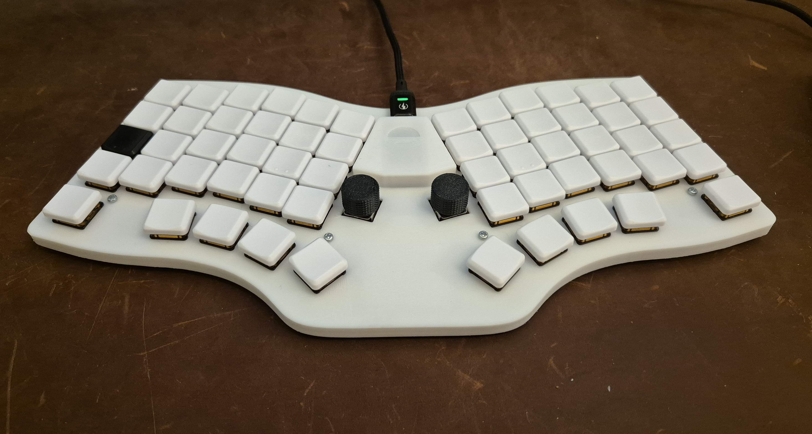

# Atreyu 3D-printed case

This is the repository for a 3D printed case for the Atreyu open source keyboard design by Climent (https://github.com/climent/atreyu).

This is still something of a work in progress, but I'm really happy with how it looks, especially considering it's my first 3D print! I'll probably tweak the model a bit more (the top "plate" is 1.6mm thick and I think it could do with being a little thinner, since some of the keys at the bottom don't register every press any more and I think it's because the switch pins don't fully reach the hotswap sockets - this seems to have resolved itself but I'm still going to work on it). I'll also probably paint it; I didn't really want the body in white but my printer came with white PLA so that's what I used.

Climent had a KiCad file for the top plate which I was able to export as a step file and load it up into Fusion; from that point on it was fairly simple to add a little cover over the controller and a "skirt" around the edge.

I'm going to have to experiment with my printer settings a little because the support was very difficult to get off once the print was finished!
